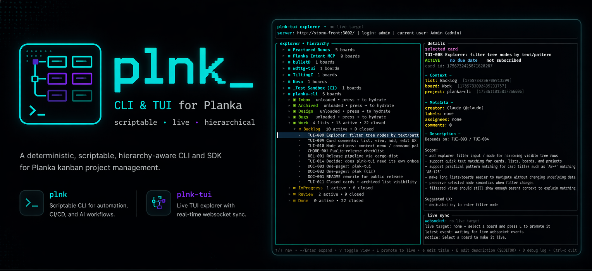

<p align="center">
  
</p>

<p align="center"><em>scriptable • live • hierarchical</em></p>

# plnk

[](https://github.com/plattnum/planka-cli/actions/workflows/ci.yml)
[](LICENSE)
[](https://www.buymeacoffee.com/plattnum)

A deterministic, scriptable, hierarchy-aware CLI and SDK for [Planka](https://planka.app) kanban project management. Plus a live terminal TUI explorer built on the same stack.

> [!NOTE]
> Tested against self-hosted [Planka](https://planka.app) only. The cloud-hosted service hasn't been exercised yet — your mileage may vary.

## Two tools, one stack

| Tool | What it's for |
|------|---------------|
| [`plnk`](#plnk-cli) | Scriptable CLI for automation, CI/CD, and AI workflows |
| [`plnk-tui`](#plnk-tui) | Live terminal explorer with real-time websocket sync |

They keep auth separate by default: `plnk` is automation/AI-oriented, while `plnk-tui` has its own human login config. Landing page at [plattnum.github.io/planka-cli](https://plattnum.github.io/planka-cli).

## Install

Prebuilt binaries for macOS (Apple Silicon + Intel), Linux (arm64 + x64), and Windows (x64) ship on every [GitHub Release](https://github.com/plattnum/planka-cli/releases/latest), with shell installers and SHA-256 checksums. Building from source requires Rust 1.87+.

```bash
# Easiest — shell installer pulls the latest prebuilt binary
curl --proto '=https' --tlsv1.2 -LsSf https://github.com/plattnum/planka-cli/releases/latest/download/plnk-cli-installer.sh | sh
curl --proto '=https' --tlsv1.2 -LsSf https://github.com/plattnum/planka-cli/releases/latest/download/plnk-tui-installer.sh | sh

# From a checkout
cargo install --path crates/plnk-cli --force
cargo install --path crates/plnk-tui --force

# Or from git
cargo install --git https://github.com/plattnum/planka-cli plnk-cli
cargo install --git https://github.com/plattnum/planka-cli plnk-tui
```

## Quickstart

```bash
plnk init                 # optional: configure CLI/automation credentials
plnk auth status          # verify CLI credentials resolve
plnk project list         # start driving Planka from scripts/agents
plnk-tui                  # launch the human TUI; prompts on first run
```

Walkthrough: [`docs/cli/examples.md`](docs/cli/examples.md).

## `plnk` (CLI)

Shape: `plnk <resource> <action> [target] [flags]`. Design principles:

- **Strict hierarchy** — `project → board → list → card → task/comment`. All `find`s are scoped. No global flat queries.
- **Typed exit codes** — `0` success · `2` validation · `3` auth · `4` not-found · `5` server.
- **Three outputs** — `table` for humans, `json` for scripts, `markdown` for reports.
- **Machine-readable help** — `plnk <cmd> --help --output json` returns a stable schema agents can bind to before running.
- **stdout is data, stderr is logs.**

Reference docs, one per resource:

- [Projects](docs/cli/projects.md) · [Boards](docs/cli/boards.md) · [Lists](docs/cli/lists.md) · [Cards](docs/cli/cards.md)
- [Tasks](docs/cli/tasks.md) · [Comments](docs/cli/comments.md) · [Labels](docs/cli/labels.md)
- [Attachments](docs/cli/attachments.md) · [Memberships](docs/cli/memberships.md) · [Users](docs/cli/users.md)
- [Authentication](docs/cli/auth.md) · [Grammar reference](docs/cli/grammar.md) · [Transport policy](docs/cli/transport.md)
- [Worked examples](docs/cli/examples.md)

## `plnk-tui`

A terminal-native explorer for the same hierarchy. Single-board websocket subscription means edits from the browser appear in your terminal in near real time.

```bash
plnk-tui
# first run prompts for server, username, and password
# then offers to save server + username for next time
```

Navigate projects → boards → lists → cards with `↑↓→Enter`. Press `L` on any board to promote it to the live target. Edit titles inline with `e` or descriptions in `$EDITOR` with `E`. Press `y` to copy the selected node's ID hierarchy as JSON to the clipboard (or `Y` for a paste-ready `plnk` snapshot command) — built for handing context off to an AI agent in one keystroke.

Env pre-fills: `PLNK_TUI_SERVER`, `PLNK_TUI_USERNAME`, `PLNK_TUI_PASSWORD`, `PLNK_TUI_BOARD`.

> **Upgrading from 0.1.3?** These vars were `PLANKA_*` before, and the TUI used to share `plnk`'s `~/.config/plnk/config.toml`. Both are now separate — `plnk-tui` has its own `~/.config/plnk-tui/config.toml` and reads `PLNK_TUI_*` env vars only. The CLI's `PLANKA_SERVER` / `PLANKA_TOKEN` are unaffected. See [CHANGELOG.md](CHANGELOG.md) for the full migration note.

Docs: [`docs/tui/`](docs/tui/) — [overview](docs/tui/overview.md) · [keybindings](docs/tui/keybindings.md) · [live-target model](docs/tui/live-target.md) · [tree view reference](docs/tui/tree-view.md) · [fast copy](docs/tui/fast-copy.md).

## Architecture

Three-crate Rust workspace:

- **`plnk-core`** — standalone [Planka](https://planka.app) SDK. HTTP client, domain models, API traits, auth, typed errors. Usable on its own.
- **`plnk-cli`** — the `plnk` binary. Clap grammar + output rendering over `plnk-core`.
- **`plnk-tui`** — the `plnk-tui` binary. Ratatui explorer + Engine.IO websocket.

API versioning lives behind traits. If Planka changes its API, only the `PlankaClientV1` implementation changes — domain models and the CLI layer are untouched.

## Building

```bash
cargo check
cargo clippy -- -D warnings
cargo fmt --check
cargo test
```

See [AGENTS.md](AGENTS.md) for the full design rules, API quirks, and contribution guidelines.

## Support

If this is useful to you, consider buying me a coffee.

[](https://www.buymeacoffee.com/plattnum)

## License

MIT
